# Hey, I'm Clyde Mugambi👋

## 💫 About Me:
I'm a backend & AI engineer-in-training, currently at Strathmore University (BSc Informatics & Computer Science, expected 2027). I like building things that actually hold up; backend systems, LLM pipelines, infrastructure that doesn't fall over at 2am. Most recently built an AI-powered infra monitoring platform that took 2nd place at the NCBA x Microsoft 2026 hackathon.  I'm currently working on: 🔭 Building an AI-powered project ideation platform for engineering education (KAG/RAG pipeline - FastAPI, Neo4j, PostgreSQL) 🌱 Levelling up my AI engineering skills 👯 Founding leadership team @Strathmore Data Community (300+ members, all things DS/ML/AI) 💬 Ask me about backend architecture, LLM pipelines, or anything infra/DevOps 🤝 I’m looking for help with further improving my understanding of the AI and ML world  

## 🌐 Socials:
  

# 💻 Tech Stack:
                                              
# 📊 GitHub Stats:
 
 
 

---

<!-- Proudly created with GPRM ( https://gprm.itsvg.in ) -->

